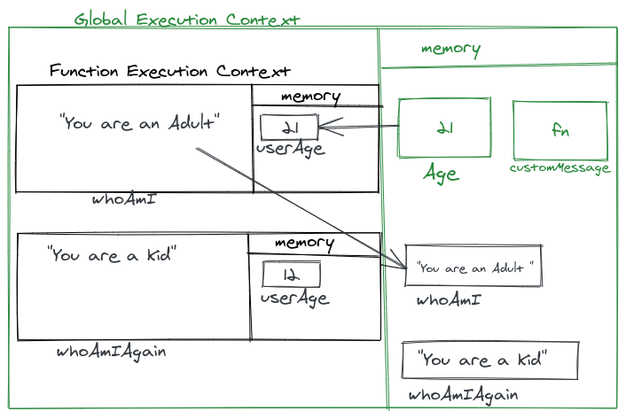

1. What does thread of execution means in JavaScript?

```js
// Ans: Thread in computer science is the execution of running multiple tasks or programs at the same time. Each unit capable of executing code is called a thread. The thread of execution is the way in which our code gets executed by the JavaScript engine.
```

2. Where the JavaScript code gets executed?
```js
// Ans: The JavaScript code gets executed inside the Execution Context.
//  In JavaScript, execution context is an abstract concept that holds information about the      environment within which the current code is being executed.

```

3. What does context means in Global Execution Context?
```js
// Ans: Context is the environment in which we are executing the code.

```
4. When do you create a global execution context.
```js
// Ans: Whenever we execute a code, the JavaScript Engine creates a Global Execution context for us. 

```
5. Execution context consists of what all things?
```js
// Ans: Execution context contains specific section which is used for storing data and is also known as memory.  

```
6. What are the different types of execution context?
```js
// Ans: The types of execution context in JavaScript are:

//  Global Execution Context/GEC
//  Functional Execution Context/FEC

```

7. When global and function execution context gets created?
```js
// Ans:  The GEC gets created whenever we run any code in JavaScript for the first time. 
//       The FEC gets created whenever we execute any function.    

```

8. Function execution gets created during function execution or while declaring a function.
```js
// Ans: The Function execution gets created during function execution and gets deleted as soon as it return a value.

```

9. Create a execution context diagram of the following code on your notebook. Take a screenshot/photo and store it in the folder named `img`. Use `` to display it here.


```js
var user = "Arya";

function sayHello(){
  return `Hello ${user}`;
}

var userMsg = sayHello(user);
```

<!-- Put your image here -->


```js
var marks = 400;
var total = 500;

function getPercentage(amount, totalAmount){
  return (amount * 100) / totalAmount;
}

var percentageMarks = getPercentage(marks, total);
var percentageProfit = getPercentage(400, 200);
```

<!-- Put your image here -->


```js
var age = 21;

function customeMessage(userAge){
  if(userAge > 18){
    return `You are an adult`;
  }else {
    return `You are a kid`;
  }
}

var whoAmI = customeMessage(age);
var whoAmIAgain = customeMessage(12);
```

<!-- Put your image here -->

